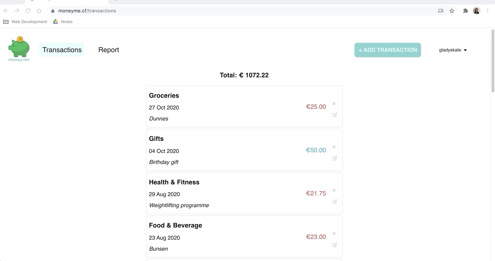
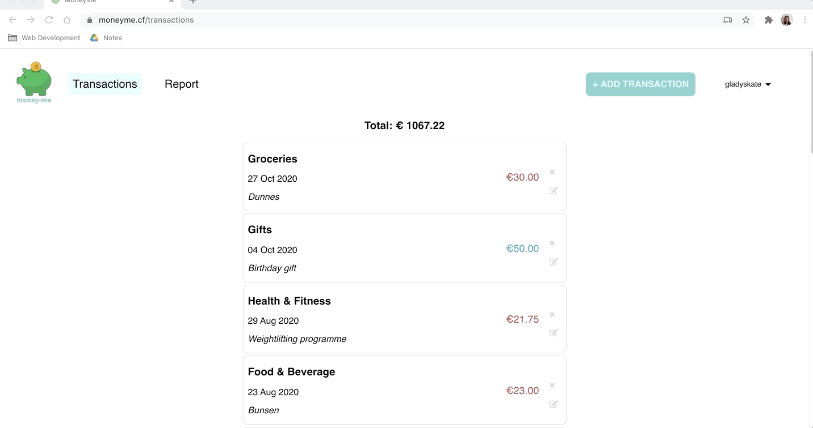
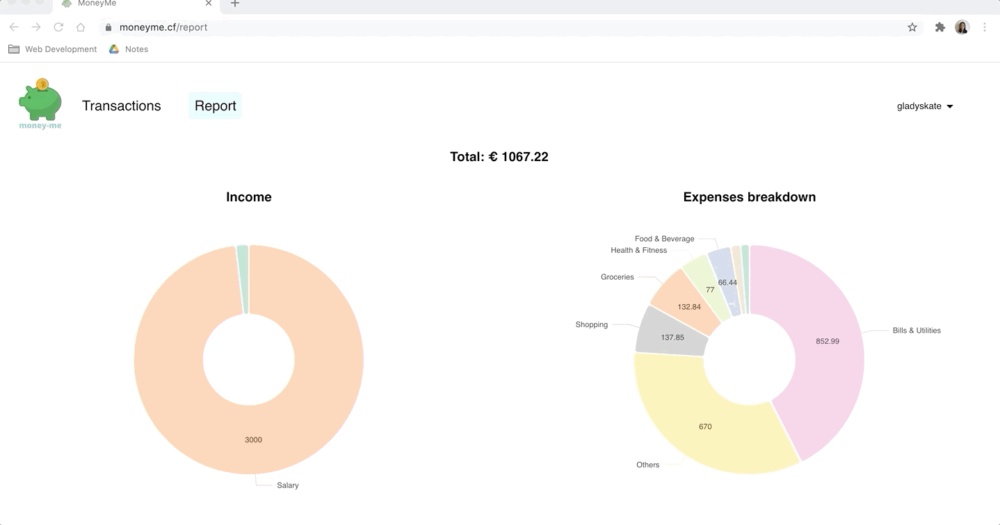

# [moneyme.cf](https://moneyme.cf)
Your friendly budget app.

## App Features
- Authentication integration, using Auth0, to allow for sign up and log in. 
- Once logged in, the user can create, update & delete a transaction, and view a list of all their transactions. 
- See a summary of all transactions through a pie chart. 

## Technologies used:

- JavaScript, React
- HTML
- CSS, SASS, Flexbox

## Libraries used:

- react
- react-router-dom
- node-sass
- axios
- day.js
- react hook form
- react day picker
- nivo/pie
- react-modal
- querystring

## Demo
#### Sign up

#### Log in

#### Create a transaction

#### Edit a transaction

#### Delete a transaction

#### Report of transactions

#### Log out
